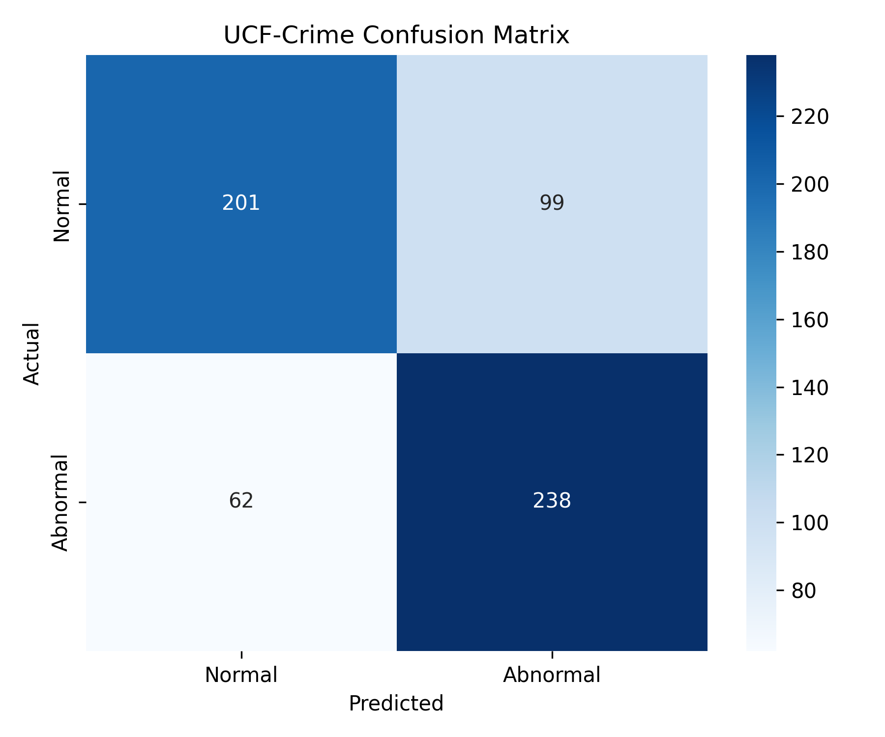
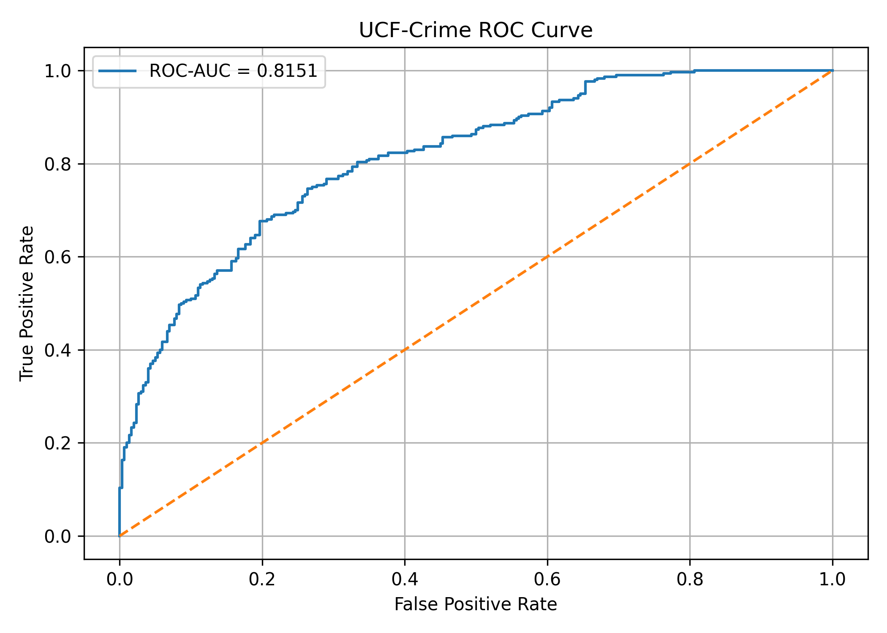

Yes — if you mean the **full README code with the images included correctly**, use this entire version:

````markdown
# UCF-Crime Abnormal Behavior Detection

A deep learning project for detecting abnormal behavior in surveillance-style images using the UCF-Crime dataset and a ResNet18 model.

---

## 📌 Project Overview

Abnormal behavior detection is an important task in intelligent surveillance systems. The goal of this project is to classify surveillance frames into two categories:

- **Normal**
- **Abnormal**

The project uses **transfer learning with ResNet18** to learn visual patterns associated with abnormal events.

The implementation uses extracted image frames from the **UCF-Crime dataset**.

---

## 🎯 Objectives

- Detect abnormal behavior from surveillance images.
- Classify frames as Normal or Abnormal.
- Apply transfer learning using a pretrained ResNet18 network.
- Evaluate the model using standard classification metrics.
- Visualize model performance using a confusion matrix and ROC curve.
- Provide a trained model for prediction.

---

## 📚 Reference Paper

This project is related to the review paper:

**"Detecting Abnormal Behavior Events and Gatherings in Public Spaces Using Deep Learning: A Review"**

**Authors:**

- Rafael Rodrigo-Guillen
- Nahuel Garcia-D’Urso
- Higinio Mora-Mora
- Jorge Azorin-Lopez

**Journal:** Journal of Sensor and Actuator Networks  
**Year:** 2025  
**Volume:** 14  
**Article:** 69

**DOI:** https://doi.org/10.3390/jsan14040069

The paper reviews deep learning approaches for abnormal behavior and event detection, including CNNs, autoencoders, transfer learning, and video-based architectures.

> **Note:** This project is an independent implementation using the UCF-Crime extracted-frame dataset and ResNet18. The results reported in this README are from this implementation, not from the review paper.

---

## 📂 Dataset

The project uses the **UCF-Crime dataset**.

For this implementation, the Kaggle version contains **extracted image frames** from UCF-Crime videos.

### Classes

The dataset contains 14 classes:

1. Abuse
2. Arrest
3. Arson
4. Assault
5. Burglary
6. Explosion
7. Fighting
8. NormalVideos
9. RoadAccidents
10. Robbery
11. Shooting
12. Shoplifting
13. Stealing
14. Vandalism

For this project, the classes were grouped into:

- **Normal**
- **Abnormal**

---

## 🗂️ Dataset Structure

```text
UCF-Crime
│
├── Train
│   ├── Abuse
│   ├── Arrest
│   ├── Arson
│   ├── Assault
│   ├── Burglary
│   ├── Explosion
│   ├── Fighting
│   ├── NormalVideos
│   ├── RoadAccidents
│   ├── Robbery
│   ├── Shooting
│   ├── Shoplifting
│   ├── Stealing
│   └── Vandalism
│
└── Test
    ├── Abuse
    ├── Arrest
    ├── Arson
    ├── Assault
    ├── Burglary
    ├── Explosion
    ├── Fighting
    ├── NormalVideos
    ├── RoadAccidents
    ├── Robbery
    ├── Shooting
    ├── Shoplifting
    ├── Stealing
    └── Vandalism
````

---

## 📊 Dataset Split

### Training Set

* **Total:** 20,000 images
* **Normal:** 10,000
* **Abnormal:** 10,000

### Testing Set

* **Total:** 4,000 images
* **Normal:** 2,000
* **Abnormal:** 2,000

---

## 🧠 Model Architecture

The project uses **ResNet18** with transfer learning.

The pretrained ResNet18 feature extractor was used and the original final classification layer was replaced with:

```text
Dropout(0.3)
      ↓
Linear(512 → 1)
```

The output is converted into an abnormal probability using the sigmoid function.

---

## 🔄 Training Approach

### Phase 1 — Transfer Learning

The pretrained ResNet18 weights were initially frozen and the final classification layer was trained.

### Phase 2 — Fine-Tuning

The final ResNet18 convolutional block (`layer4`) and classifier were then unfrozen.

This allowed the model to adapt its learned features to UCF-Crime surveillance frames.

---

## 🖼️ Image Preprocessing

Images were resized to:

```text
224 × 224 pixels
```

Training augmentation:

* Random horizontal flip
* Random rotation
* Color jitter
* ImageNet normalization

Testing:

* Resize
* ImageNet normalization

---

## ⚙️ Training Configuration

| Parameter                 | Value               |
| ------------------------- | ------------------- |
| Model                     | ResNet18            |
| Input size                | 224 × 224           |
| Batch size                | 64                  |
| Loss function             | BCEWithLogitsLoss   |
| Optimizer                 | Adam                |
| Initial learning rate     | 0.001               |
| Fine-tuning learning rate | 0.0001              |
| Weight decay              | 0.0001              |
| Dropout                   | 0.3                 |
| Device                    | NVIDIA Tesla T4 GPU |
| Training images           | 20,000              |
| Testing images            | 4,000               |

---

# 📈 Final Results

The final model was evaluated on **4,000 test images**.

| Metric    |      Score |
| --------- | ---------: |
| Accuracy  | **75.28%** |
| Precision | **71.18%** |
| Recall    | **84.95%** |
| F1-Score  | **77.46%** |
| ROC-AUC   | **0.7927** |

### Interpretation

The model achieved **75.28% accuracy** on the selected test set.

The abnormal-event recall was **84.95%**, meaning the model correctly identified a substantial proportion of abnormal samples.

The ROC-AUC was **0.7927**, indicating useful discrimination between normal and abnormal samples on this test set.

---

# 📊 Confusion Matrix

The final confusion matrix was:

|                     | Predicted Normal | Predicted Abnormal |
| ------------------- | ---------------: | -----------------: |
| **Actual Normal**   |             1312 |                688 |
| **Actual Abnormal** |              301 |               1699 |

### Confusion Matrix



---

# 📉 ROC Curve

The final model achieved:

**ROC-AUC = 0.7927**

### ROC Curve



---

## 🧪 Sample Validation

The final saved model was tested on individual UCF-Crime frames.

### Abnormal Example

**Dataset class:** Burglary

```text
Actual:     ABNORMAL
Prediction: ABNORMAL
Confidence: 99.62%
```

### Normal Example

**Dataset class:** NormalVideos

```text
Actual:     NORMAL
Prediction: NORMAL
Confidence: 98.09%
```

These are individual validation examples and should not be interpreted as the overall model accuracy.

---

## 🔍 Prediction Pipeline

```text
Input Image
     ↓
Resize to 224 × 224
     ↓
ImageNet Normalization
     ↓
ResNet18
     ↓
Linear Classifier
     ↓
Sigmoid
     ↓
Abnormal Probability
     ↓
Threshold = 0.5
     ↓
Normal / Abnormal
```

---

## 💾 Trained Model

The final trained model is available in the **v2.0 GitHub Release**.

### Model

```text
resnet18_ucf_crime_final.pth
```

---

## 📁 Project Files

```text
UCF-Crime-Abnormal-Behavior-Detection
│
├── README.md
├── UCF_Crime_Results.csv
├── UCF_Crime_Confusion_Matrix.png
├── UCF_Crime_ROC_Curve.png
└── resnet18_ucf_crime_final.pth
```

---

## 🛠️ Technologies Used

* Python
* PyTorch
* Torchvision
* ResNet18
* NumPy
* Pandas
* Scikit-learn
* Matplotlib
* Seaborn
* Kaggle Notebook
* UCF-Crime Dataset

---

## 💻 Hardware

The model was trained using:

```text
GPU: NVIDIA Tesla T4
```

Training was performed in a Kaggle Notebook environment.

---

## 🚀 Future Improvements

* Train on a larger portion of UCF-Crime.
* Use temporal information from video sequences.
* Experiment with 3D CNN architectures.
* Explore CNN-LSTM architectures.
* Explore SlowFast and other video architectures.
* Apply stronger data augmentation.
* Perform hyperparameter optimization.
* Develop video-level abnormal event detection.
* Test on additional surveillance datasets.
* Develop real-time abnormal event detection.

---

## ⚠️ Limitations

1. The experiment uses extracted image frames rather than complete video sequences.
2. Only a subset of the available UCF-Crime frames was used.
3. The model performs binary classification rather than identifying the specific abnormal event category.
4. Individual images do not contain temporal information from the original videos.
5. Performance on images outside the UCF-Crime distribution may differ from performance on dataset frames.
6. The reported metrics apply to the selected test set used in this experiment.

---

## 🔐 Responsible Use

This project is intended for educational and research purposes.

Automated abnormal-behavior detection can produce false positives and false negatives. Model predictions should therefore not be treated as definitive evidence of wrongdoing or used as the sole basis for consequential decisions.

---

## 👩‍💻 Author

**Dhruvee Salian**

Artificial Intelligence and Data Science Student

---

## ⭐ Acknowledgements

* UCF-Crime dataset
* PyTorch and Torchvision
* Kaggle
* Research community working on video anomaly and abnormal behavior detection

---

## 📜 License

This project is intended for educational and research purposes.

Please refer to the licensing and usage conditions of the original UCF-Crime dataset and referenced research before redistributing dataset content.

````

### Important

I used:

```html

````

instead of Markdown image syntax because it gives you more reliable control over the displayed size.

Your GitHub root should contain these **four files alongside `README.md`**:

```text
README.md
UCF_Crime_Confusion_Matrix.png
UCF_Crime_ROC_Curve.png
UCF_Crime_Results.csv
```

The `.pth` can remain in your **v2.0 Release**.
